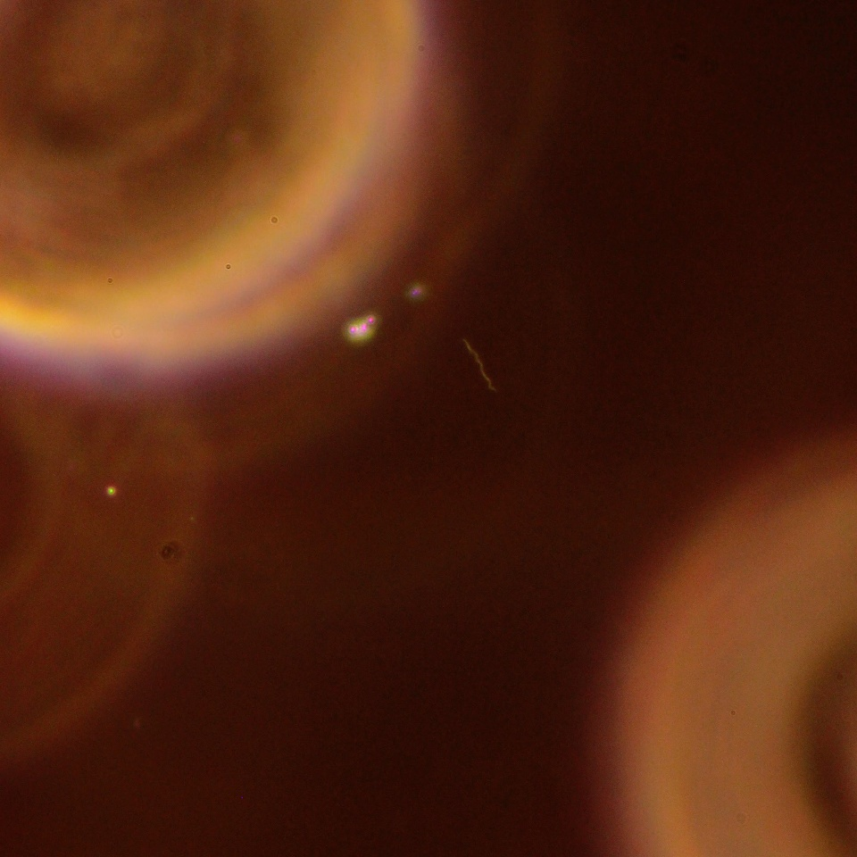
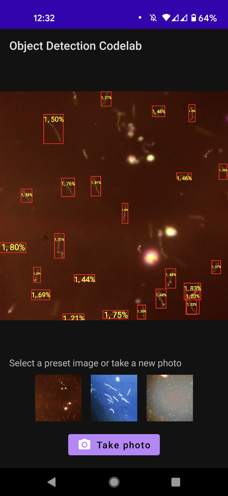

# Training a TF-Lite Object Dectection Model with Spirochete Images

### We are seeking collaborators in order to collect more images to improve the detection model!!
Countact us at spirocount@gmail.com

### Brief Summary
*Last ppdate: 11/15/2021*
This is a test to see if convloutional neural network-based object detection running on a cell phone can be used for counting of morphologically diverse bacteria like spirochetes. Pathogenic spirochetes are routinely counted under the microscope in research laboratories, an automated counting method may reduce time intesiveness of this process. This project was inspired by this tutorial by the tensorflow team: 

* [youtube video](https://www.youtube.com/watch?v=vLxn5mOuWAk&t=1529s)
* [codelabs](https://codelabs.developers.google.com/tflite-object-detection-android#0)

The numbered list outlines steps taken to train the tflite model. To build your own model from the images.zip file provided in this repository, skip step 2 and 3 (these steps are already done for you). The unzipped 'images' folder should be in the directory with the jupytr notebooks and python script given.

To see the app built with the model trained using this respoistory see https://github.com/djewing/Spirocount

### 1. Environment

This project is currently using windows 10. Anaconda, CUDA, CuDNN are installed using this [tutorial](https://github.com/EdjeElectronics/TensorFlow-Object-Detection-API-Tutorial-Train-Multiple-Objects-Windows-10)

The requirements for the notebooks below are communicated in the environment.yml
* python 3.7
* tflite-model-maker==0.3.1 (this should install tensorflow GPU for itself.)
* tensorflow==2.5.0
* pycocotools
* Additional packages openCV, numpy, pandas.

[Potentially useful compatibilitty list](https://www.tensorflow.org/install/source#tested_build_configurations)

### 2. Gethering Images and preprocessing

Images were taken under the darkfield microscope using a DSLR camera attached to the phototube.

  

The tensorflow_lite model maker recommends images sizes and formats. I used a OpenCV preprocess images JUPTR notebook here. For my training I selected and preprocessed images such that:
* images contained spirochetes that can be boardered by a box
* images are in jpg format
* images are square in dimension
* images are 960 by 960 resolution maximum 
* images were passed through google photo processing for contrast and brightness
* Each image was saved at each point in processing

### 3. Annotation

The objects in the image need to be annotated by hand. Annotation marks the location of the objects to be identified in each image. "labelimg" software was used for annotation.

https://github.com/tzutalin/labelImg

Rules for annotation I used
* sqare must have atleast one tail encompassed
* minmum the size of sqare as much as possible 
* class 1: high resolution image with morphology apparent
* class 2: out of focus
* calss 3: low resolution images with no morphology
Later I can combine or separate these classes to see if there are any benefits for model training.

  

About 200 images are use to build model in this repository (subject to change). Images.zip is provided and includes images I gathered and annotated. files can be unpacked to a folder called images to follow along with the Jupyter notebooks starting from step 4.

### 4. Generate dataloader csv for TF_Lite model maker

The labelimg software outputs .xml file for each annotated image. The .xml file contains the class and coordinates of the objects in the image. The uses the xml_to_csv.py by Dan Tran found [here.](https://github.com/datitran/raccoon_dataset) 

First run the following python script from console to output a images_labels.csv file:

``
python 4_xml_to_csv.py
``

Then I used this code I wrote in jupytr note book, 4_produce_TFlite_train_CSV.ipynb, to calculate data inputs expected by the TF_Lite model maker dataloader feature. This notebook takes images_labels.csv file as an input and outputs a data.csv for the dataloader to read. Outputs include the file name, positions of the objects, and assignment of the image for training, testing, or validation.

Final data format in the csv is expalined [here.](https://www.tensorflow.org/lite/tutorials/model_maker_object_detection)

### 5. Train a tensorflow lite model

In the 5_TF-lite-model-maker.ipynb notebook the tesnorflow model is trained. I followed the code labs found [here.](https://www.tensorflow.org/lite/tutorials/model_maker_object_detection) The TF_lite model maker takes the images and the annotations found in the data.csv file to train a tensorflow model for object detection. We download the ['efficientdet_lite2'](https://arxiv.org/abs/1911.09070) to train in this notebook.

### 6. Data augmentation

Spirochete are present in the image facing all all angles. To test if adding additional images of spirochetes from different angles help train a more functional model, we introduced mirrored images and 90 degrees clockwise rotated images. This allows each spirochete in an image to represent 3 different possible orientation of how a spirochete may appear in an image.

* To create the transformed images use: 6_mirror_transpose.ipynb
* To create annnotation for the transformed images use: 6_data_augmentation.ipynb
* To run the TF-lite0model builder using the new annotations and images: 6_Aug_TF-lite-model.ipynb

### 7. Enter model to test app

The model was entered into a test app found here
We are currently build an app which uses spirochete detecting model to count spirochetes [here:](https://github.com/djewing/Spirocount)

  

### 8. Evaluate models. 

The models were evaluated in jupytr notebooks using the testing and validation datasets. But, to better understand the behavior of the models the test app was used to understand the short comings of the model to imporve the training process. 

### Future direction

It is my current intention to use this model to learn more about techniques in neural netwroks and more sophisticated ways to visualize and evaluate these models. I also intend to build a open source microscope from the openflexure project (https://openflexure.org/). One can concievable automatically focus and count spirochetes combining this model and an automated programmable microscope. 
